# Better Zabbix Docker - Clustered HA Deployment

> High-Availability Docker Compose configuration for Zabbix monitoring system with Grafana dashboards

- [GitHub Repository](https://github.com/themimi974/better-zabbix-docker)
- [Official Zabbix Dockerfiles](https://github.com/zabbix/zabbix-docker)
- [Zabbix plugin for Grafana dashboard](https://github.com/grafana/grafana-zabbix)

---

## Architecture Overview



<!-- Alternative ASCII diagram (remove after adding SVG):
```
┌────────────────────────────────────────────────────────────────────────────┐
│                            YOUR INFRASTRUCTURE                              │
│                                                                            │
│   ┌────────────────────────────────────────────────────────────────────┐   │
│   │                    network-zabbix (Docker Bridge)                 │   │
│   │                                                                    │   │
│   │  ┌──────────────┐       ┌──────────────┐       ┌──────────────┐   │   │
│   │  │ postgres-   │       │ postgres-    │       │ zabbix-     │   │   │
│   │  │ primary     │◄─────►│ replica      │       │ server-1    │   │   │
│   │  │ (port 5432) │  R/W  │ (port 5433)  │       │ (port 10051)│   │   │
│   │  │   [MAIN]    │       │  [STANDBY]   │       │  [ACTIVE]  │   │   │
│   │  └──────────────┘       └──────────────┘       └──────┬───────┘   │   │
│   │                                                    │             │   │
│   │                                    ┌───────────────┴────────┐     │   │
│   │                                    │  zabbix-server-2      │     │   │
│   │                                    │  (port 10052)         │     │   │
│   │                                    │  [STANDBY/FAILOVER]   │     │   │
│   │                                    └───────────┬────────────┘     │   │
│   │                                                    │             │   │
│   │    ┌───────────────────────────────────────────────┼─────────┐     │   │
│   │    │                                               │         │   │
│   │    ▼                                               ▼         ▼     │
│   │  ┌──────────┐                                 ┌──────────┐       │
│   │  │ frontend │                                 │ grafana  │       │
│   │  │ :8080   │                                 │  :3000  │       │
│   │  └────────┘                                 └─────────┘       │
│   └────────────────────────────────────────────────────────────────────┘   │
└────────────────────────────────────────────────────────────────────────────┘
```
-->

---

## Quick Start

### 1. Clone and Start

```shell
git clone https://github.com/themimi974/better-zabbix-docker.git
cd better-zabbix-docker
docker compose up -d
```

Wait ~2-3 minutes for first startup. Then access:
- **Zabbix UI**: http://localhost:8080 (Admin / zabbix)
- **Grafana**: http://localhost:3000 (admin / 12345)

### 2. Verify HA is Working

```shell
docker compose exec postgres-primary psql -U zabbix -c "SELECT name, status FROM ha_node;"
```

Expected output:
```
     name      | status 
--------------+--------
 zabbix-server-1 |      3   ← Active
 zabbix-server-2 |      0   ← Standby
```

Status codes: `3` = Active, `0` = Standby, `1` = Stopped, `2` = Unavailable

---

## Daily Administration

### 🔴 What Happens When a Server Fails?

```
BEFORE FAILURE:                 AFTER FAILURE:

┌─────────────────┐          ┌─────────────────┐
│ zabbix-server-1   │          │ zabbix-server-1   │ ✗ CRASHED
│ [ACTIVE] ✅     │          │ [STOPPED] ❌    │
└────────┬────────┘          └────────┬────────┘
         │                            ┌───┘
         │ 10 seconds later         │ FAILS OVER
         ▼                          ▼
┌─────────────────┐          ┌─────────────────┐
│ zabbix-server-2  │ ──────►  │ zabbix-server-2  │
│ [STANDBY]       │          │ [ACTIVE] ✅     │
└─────────────────┘          └─────────────────┘
```

**You don't need to do anything!** Zabbix automatically detects the failure and promotes server-2 to active.

### 🔧 Common Tasks

#### Check Status
```shell
# View all running containers
docker compose ps

# Check HA nodes in database
docker compose exec postgres-primary psql -U zabbix -c "SELECT * FROM ha_node;"
```

#### Restart a Zabbix Server
```shell
# Restart server-1 (will become standby if server-2 is active)
docker compose restart zabbix-server-1

# Restart server-2 (will become standby if server-1 is active)
docker compose restart zabbix-server-2
```

#### Stop Active Server (Test Failover!)
```shell
# Stop the active server to test failover
docker compose stop zabbix-server-1

# Check who's now active
docker compose exec postgres-primary psql -U zabbix -c "SELECT name, status FROM ha_node;"

# Frontend should still work!
curl -I http://localhost:8080
```

#### Bring Everything Down/Up
```shell
# Stop all services
docker compose down

# Start all services
docker compose up -d
```

#### View Logs
```shell
# All services
docker compose logs -f

# Specific server only
docker compose logs -f zabbix-server-1
docker compose logs -f zabbix-server-2
```

---

## Components Reference

| Container | Role | Port | Description |
|-----------|------|------|-------------|
| `postgres-primary` | Primary DB | 5432 | Main database (read/write) |
| `postgres-replica` | Standby DB | 5433 | Read-only replica |
| `zabbix-server-1` | Active/Standby | 10051 | Primary server node |
| `zabbix-server-2` | Active/Standby | 10052 | Secondary server node |
| `zabbix-frontend` | Web UI | 8080/8443 | Zabbix web interface |
| `zabbix-agent` | Agent | 10050 | Monitors the cluster |
| `grafana` | Dashboards | 3000 | Grafana visualization |

---

## Troubleshooting

### ❌ "Only one server in ha_node table"

**Problem**: Only one server registered, HA not working.

**Solution**:
```shell
# Restart both servers
docker compose restart zabbix-server-1 zabbix-server-2
wait 30 seconds
docker compose exec postgres-primary psql -U zabbix -c "SELECT * FROM ha_node;"
```

### ❌ "Frontend shows connection error"

**Problem**: Can't connect to Zabbix server.

**Solution**:
```shell
# Check which server is active
docker compose exec postgres-primary psql -U zabbix -c "SELECT name, status FROM ha_node;"

# Restart frontend
docker compose restart zabbix-frontend
```

### ❌ "Server keeps restarting"

**Problem**: Server container crashes continuously.

**Solution**:
```shell
# Check logs
docker compose logs zabbix-server-1

# Restart with fresh database (last resort)
docker compose down -v
docker compose up -d
```

---

## Network Configuration

### External Access

| Service | Host Port | Container | Purpose |
|---------|----------|-----------|---------|
| Zabbix UI | 8080 | 80 | HTTP web interface |
| Zabbix UI | 8443 | 443 | HTTPS web interface |
| Grafana | 3000 | 3000 | Dashboards |

### Internal Ports (not exposed)

| Service | Internal Port | Used By |
|---------|--------------|---------|
| Zabbix Server-1 | 10051 | Frontend, Agents |
| Zabbix Server-2 | 10051 | Frontend, Agents |
| PostgreSQL | 5432 | Servers |
| PostgreSQL Replica | 5432 | Read queries |

---

## Configuration

### Environment Variables (.env)

| Variable | Default | Description |
|----------|---------|-------------|
| `POSTGRES_USER` | `zabbix` | Database user |
| `POSTGRES_PASSWORD` | `zabbix` | Database password |
| `ZBX_HANODENAME_1` | `zabbix-server-1` | Node 1 name |
| `ZBX_HANODENAME_2` | `zabbix-server-2` | Node 2 name |
| `GRAFANA_USER` | `admin` | Grafana admin |
| `GRAFANA_SECRET` | `12345` | Grafana password |
| `TZ` | `UTC` | Timezone |

> ⚠️ **Production**: Change default passwords in `.env` before deploying!

---

## Security Checklist

Before production use:

- [ ] Change `POSTGRES_PASSWORD` in `.env`
- [ ] Change `GRAFANA_SECRET` in `.env`  
- [ ] Enable firewall rules (only allow ports 8080, 3000)
- [ ] Enable HTTPS (configure SSL certificates)
- [ ] Configure regular database backups

---

## References

- [Zabbix HA Documentation](https://www.zabbix.com/documentation/current/manual/config/ha)
- [PostgreSQL Replication](https://www.postgresql.org/docs/current/static/high-availability.html)
- [Official Zabbix Docker Images](https://github.com/zabbix/zabbix-docker)
- [Zabbix Plugin for Grafana](https://github.com/grafana/grafana-zabbix)